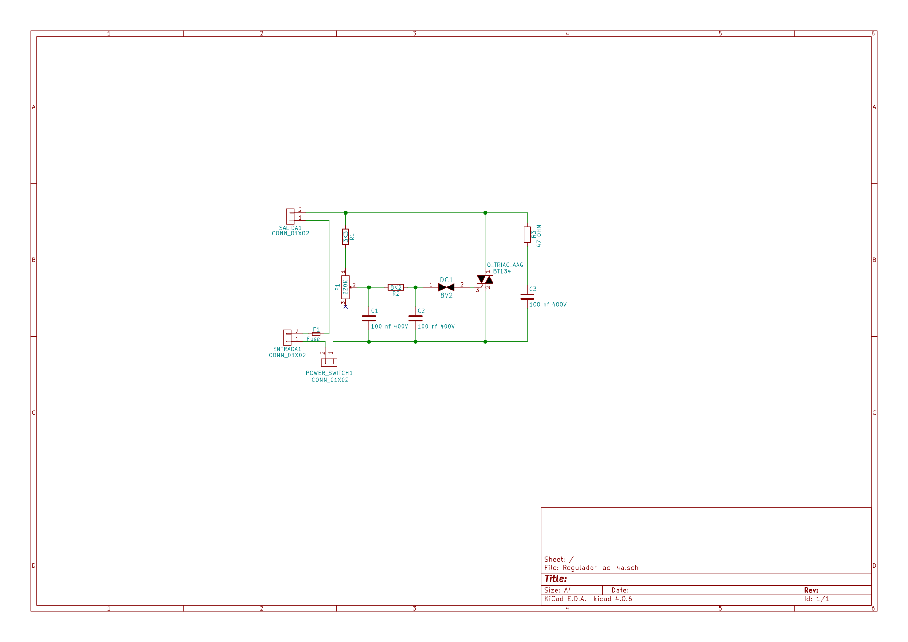
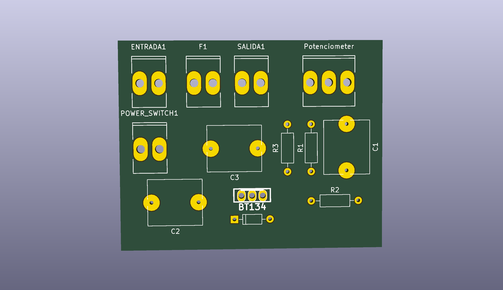
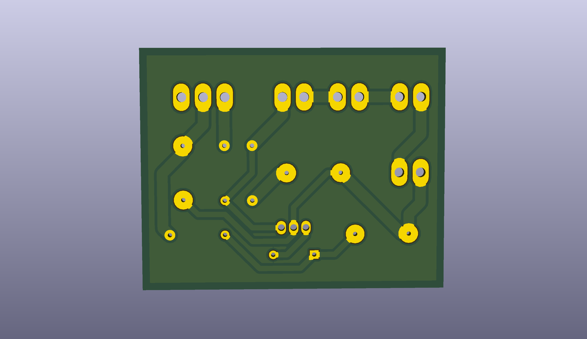

# Regulador AC 4A

El Circuito esta basado en el regulador de 3800W que hizo Jose Manuel (@TerrazoCultor) que puedes ver en su blog 

https://100ciaencasa.blogspot.com.es/2014/02/circuitos-utiles-02-regulador-corriente.html

Este regulador puede controlar hasta una corriente de 900W, ideal para un taladro o un torno manual.

